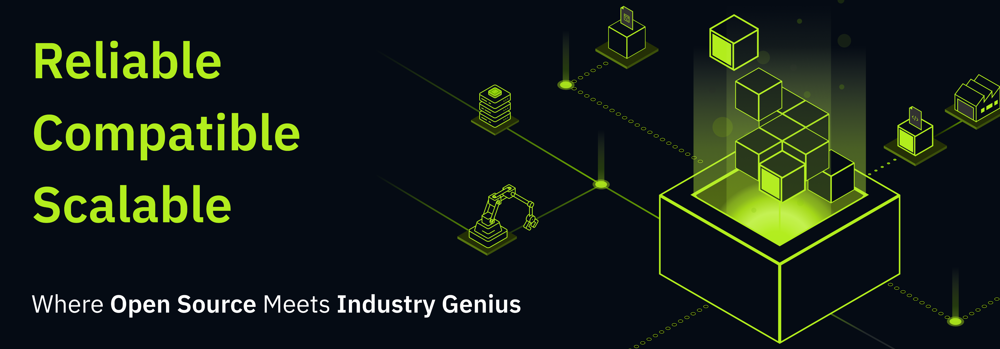

## Hi there 👋

 
# Welcome to [FREEZONEX](https://supos.ai/company/about-us)

**FREEZONEX** is on a mission to Revolutionize Industrial Software and Elevate Digital Experiences.

Built for **Industry** and **Smart City**, we've launched an advanced **IIoT platform - [supOS](https://supos.ai/product/supos)** that empowers you to connect, analyze, and transform factory operations. Enhance digital capabilities and unlock smarter insights by leveraging data effectively. The **[supOS Community Edition](https://github.com/orgs/FREEZONEX)** is now open-source. [Download and experience now!](https://github.com/orgs/FREEZONEX)

At **FREEZONEX**, we're not just building solutions—we're reimagining what's possible, pushing the boundaries to **Create a World that Never Has Been**.

---

## Let's build an open and vibrant community together 🚀

- [Join FREEZONEX](https://supos.ai/company/career)
- [Join our Community](https://discord.gg/G2zdNb52Vq)
- [Check out our Blog](https://supos.ai/blogs/menu)
- [Read our Documentation](https://suposdocs.vercel.app/)
- [Know more about FREEZONEX](https://supos.ai/)

---
## Connect with Us

  
  
  
   
  
   
  
   
  

 
